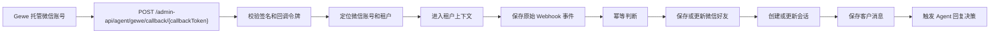
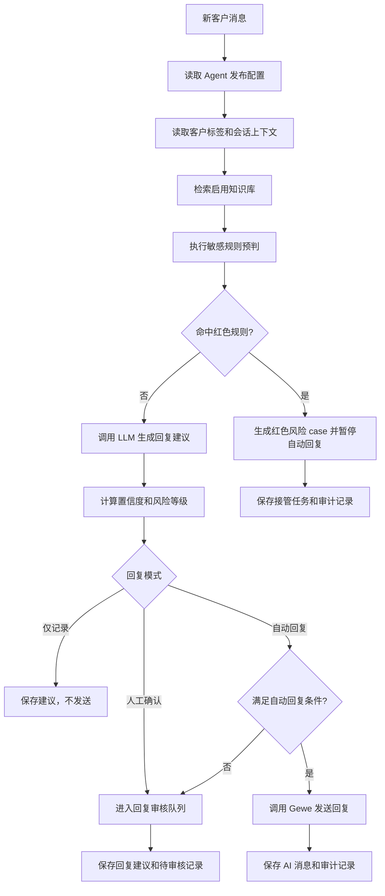

# ai-sales-agent 后台模块设计

版本：V1 可运营闭环版
日期：2026-05-19
所属项目：ai-sales

## 1. 设计目标

ai-sales-agent 作为 ai-sales 的独立业务模块，承载微信销售 Agent 的后台运营能力。第一版本不是只做消息查看，而是形成完整运营闭环：租户接入多个 Gewe 托管微信账号，系统接收微信好友消息，沉淀好友、会话和消息记录，调用 LLM 生成回复建议或自动回复，并基于客户标签、知识库和敏感规则判断是否需要人工接管。

V1 的核心目标是让运营人员可以配置 Agent、管理微信账号、查看客户会话、维护客户标签和知识库、配置敏感规则，并对自动回复进行风险控制和审计追溯。

## 2. 模块定位

模块名称建议为 `sales-module-agent`，后端包名为 `cn.ai.sales.module.agent`，后台菜单名称为 `AI 销冠`，路由前缀为 `/agent`。

该模块不直接复用当前已隐藏的 `sales-module-ai`。LLM 能力在本模块中先抽象为 `LlmReplyClient` 接口，Gewe 能力抽象为 `GeweClient` 接口。这样 V1 可以先接入一个模型和一个微信托管服务，后续替换模型、增加模型路由或更换微信服务商时，不需要重写业务主链路。

## 3. V1 范围

V1 包含以下能力：

- Gewe 微信账号托管接入。
- Gewe 回调接收微信好友消息。
- 微信账号管理，一个租户可管理多个微信账号。
- 微信好友管理，目标客户和重要客户基于微信好友实现。
- 客户标签管理。
- 会话与消息记录。
- LLM 回复建议。
- 自动回复。
- 人工审核和人工接管。
- 敏感规则配置。
- 红色风险暂停自动回复。
- 知识库管理。
- Agent 基础配置、回复策略、版本发布记录。

V1 不包含复杂团队协作、每日复盘、A/B 测试、多模型调度、外部 CRM 同步和销售业绩归因。这些能力进入后续版本路线图。

## 4. 核心业务流程

### 4.1 微信消息接入流程

Gewe 回调接口不是后台登录用户发起的请求，因此接口需要忽略默认租户校验。服务层通过 `callbackToken`、Gewe 账号 ID 或签名字段定位 `agent_wechat_account`，拿到 `tenant_id` 后使用 `TenantUtils.execute(tenantId, () -> {...})` 执行业务逻辑，保证数据写入正确租户。

### 4.2 Agent 回复决策流程

自动回复必须同时满足：Agent 已发布且运行中、微信账号已绑定该 Agent、回复模式允许自动回复、未命中红色敏感规则、置信度达到阈值、未超过连续自动回复上限、当前在允许回复时间内。

### 4.3 人工审核流程

运营或销售人员在后台查看回复审核列表，可以通过、修改、拒绝或标记人工接管。通过或修改后系统调用 Gewe 发送消息，并将消息保存为 `AI_AGENT` 或 `HUMAN_ADVISOR` 来源，保留审核人和修改记录。拒绝后只保留回复决策和审计说明，不发送给客户。

## 5. 后台菜单设计

V1 菜单建议如下：

- `AI 销冠 / Agent 管理`：Agent 基础配置、回复策略、发布版本。
- `AI 销冠 / 微信账号`：Gewe 托管账号、回调地址、绑定 Agent、账号状态。
- `AI 销冠 / 客户好友`：微信好友、目标客户、重要客户、客户标签、负责人。
- `AI 销冠 / 会话记录`：按微信账号和好友查看消息线程。
- `AI 销冠 / 回复审核`：待确认回复建议、通过、修改、拒绝、发送。
- `AI 销冠 / 风险会话`：黄红风险会话、命中规则、人工接管状态。
- `AI 销冠 / 知识库`：知识源维护、启停、适用 Agent。
- `AI 销冠 / 敏感规则`：规则名称、风险等级、触发条件、处理动作。

## 6. 数据模型

所有业务表默认带 `tenant_id`，DO 继承 `TenantBaseDO`。Gewe 原始事件、消息、回复决策和风险记录都需要保留审计字段，避免后续排查时只能依赖外部平台。

### 6.1 agent_agent

Agent 主表。

- `id`：主键。
- `tenant_id`：租户编号。
- `name`：Agent 名称。
- `alias_name`：展示别名。
- `owner_user_id`：负责人用户编号。
- `scene`：销售场景。
- `target_customer_desc`：目标客户描述。
- `tone`：沟通语气。
- `welcome_message`：欢迎语。
- `handover_message`：转人工提示文案。
- `business_hours`：营业时间配置，JSON。
- `follow_up_policy`：跟进节奏配置，JSON。
- `reply_mode`：回复模式，`AUTO`、`MANUAL_CONFIRM`、`RECORD_ONLY`。
- `confidence_threshold`：自动回复置信度阈值。
- `max_continuous_auto_reply`：单客户连续自动回复上限。
- `quiet_minutes`：静默时间。
- `material_priority`：素材优先级配置。
- `status`：状态，`DRAFT`、`RUNNING`、`PAUSED`、`DISABLED`。
- `draft_version`：草稿版本号。
- `online_version`：线上版本号。
- `published_config`：已发布配置快照，JSON。

### 6.2 agent_wechat_account

Gewe 托管微信账号。

- `id`：主键。
- `tenant_id`：租户编号。
- `agent_id`：默认绑定 Agent。
- `owner_user_id`：负责人用户编号。
- `gewe_app_id`：Gewe 应用或设备标识。
- `gewe_account_id`：Gewe 账号标识。
- `wechat_id`：微信号。
- `nickname`：微信昵称。
- `avatar`：头像。
- `callback_token`：回调令牌。
- `callback_secret`：回调签名密钥。
- `callback_url`：展示给 Gewe 配置的回调地址。
- `login_status`：登录状态，`ONLINE`、`OFFLINE`、`EXPIRED`。
- `status`：启用状态。
- `last_heartbeat_time`：最近心跳时间。

### 6.3 agent_wechat_contact

微信好友，即 PRD 中的目标客户和重要客户。

- `id`：主键。
- `tenant_id`：租户编号。
- `wechat_account_id`：所属托管微信账号。
- `external_user_id`：Gewe 返回的好友唯一标识。
- `wechat_id`：好友微信号。
- `nickname`：好友昵称。
- `remark`：微信备注。
- `avatar`：头像。
- `customer_level`：客户等级，`NORMAL`、`TARGET`、`IMPORTANT`。
- `owner_user_id`：负责人用户编号。
- `risk_level`：当前风险等级，`GREEN`、`YELLOW`、`RED`。
- `last_message_time`：最近消息时间。
- `last_conversation_status`：最近会话状态。

### 6.4 agent_customer_tag 与 agent_contact_tag

客户标签表和客户标签关联表。

标签支持租户级维护，字段包括 `name`、`color`、`description`、`status`。客户可绑定多个标签，用于 Agent 提示词、后台筛选和运营分层，例如“高意向”“价格敏感”“老客户”“重点跟进”。

### 6.5 agent_conversation

会话表。

- `id`：主键。
- `tenant_id`：租户编号。
- `agent_id`：当前处理 Agent。
- `wechat_account_id`：托管微信账号。
- `contact_id`：微信好友。
- `status`：`OPEN`、`AI_AUTO`、`WAITING_CONFIRM`、`HUMAN_TAKEOVER`、`CLOSED`。
- `risk_level`：当前风险等级。
- `last_message_id`：最近消息编号。
- `last_message_time`：最近消息时间。
- `continuous_auto_reply_count`：连续自动回复次数。
- `human_takeover_user_id`：接管人。
- `human_takeover_time`：接管时间。

### 6.6 agent_message

消息表，保存客户消息、AI 消息、人工消息和系统建议。

- `id`：主键。
- `tenant_id`：租户编号。
- `conversation_id`：会话编号。
- `wechat_account_id`：托管微信账号。
- `contact_id`：微信好友。
- `direction`：方向，`INBOUND`、`OUTBOUND`。
- `sender_type`：发送方，`CUSTOMER`、`AI_AGENT`、`HUMAN_ADVISOR`、`SYSTEM`。
- `message_type`：消息类型，`TEXT`、`IMAGE`、`VOICE`、`VIDEO`、`FILE`、`LINK`、`MINI_PROGRAM`、`UNKNOWN`。
- `content`：文本内容或摘要。
- `raw_payload`：原始消息 JSON。
- `gewe_message_id`：Gewe 消息编号。
- `send_status`：发送状态，`RECEIVED`、`PENDING_REVIEW`、`SENT`、`FAILED`、`REJECTED`。
- `intent`：识别意图。
- `matched_policy`：命中策略摘要。
- `audit_note`：审计说明。
- `operator_user_id`：人工操作人。
- `message_time`：消息发生时间。

### 6.7 agent_webhook_event

Gewe 原始回调事件。

- `id`：主键。
- `tenant_id`：租户编号。
- `wechat_account_id`：托管微信账号。
- `event_id`：事件唯一键。
- `event_type`：事件类型。
- `signature_valid`：签名是否通过。
- `raw_payload`：原始 JSON。
- `process_status`：处理状态，`NEW`、`PROCESSED`、`DUPLICATE`、`FAILED`。
- `error_message`：失败原因。

`event_id` 和 `wechat_account_id` 需要建立唯一索引，保证 Gewe 重试时幂等。

### 6.8 agent_reply_decision

回复决策记录。

- `id`：主键。
- `tenant_id`：租户编号。
- `conversation_id`：会话编号。
- `inbound_message_id`：客户消息编号。
- `suggested_message_id`：建议消息编号。
- `sent_message_id`：实际发送消息编号。
- `decision_type`：`AUTO_SEND`、`MANUAL_CONFIRM`、`RECORD_ONLY`、`HUMAN_TAKEOVER`。
- `risk_level`：风险等级。
- `confidence`：置信度。
- `llm_model`：模型名称。
- `prompt_snapshot`：提示词快照。
- `knowledge_refs`：知识引用 JSON。
- `guardrail_hits`：敏感规则命中 JSON。
- `decision_reason`：决策原因。
- `review_status`：`PENDING`、`APPROVED`、`EDITED`、`REJECTED`、`SENT`。
- `review_user_id`：审核人。
- `review_time`：审核时间。

### 6.9 agent_guardrail

敏感规则。

- `id`：主键。
- `tenant_id`：租户编号。
- `agent_id`：适用 Agent，空值表示租户通用规则。
- `name`：规则名称。
- `risk_level`：`GREEN`、`YELLOW`、`RED`。
- `match_type`：`KEYWORD`、`REGEX`、`LLM_CLASSIFIER`。
- `match_config`：匹配配置 JSON。
- `action`：`ALLOW`、`MANUAL_CONFIRM`、`PAUSE_AND_TAKEOVER`。
- `route_app`：处理应用，例如后台、企业微信、飞书。
- `status`：启用状态。

### 6.10 agent_knowledge_source

知识库来源。

- `id`：主键。
- `tenant_id`：租户编号。
- `agent_id`：适用 Agent。
- `name`：知识源名称。
- `source_type`：`TEXT`、`URL`、`FILE`、`FAQ`。
- `scope`：覆盖范围。
- `content`：文本内容或摘要。
- `source_url`：外部地址。
- `file_id`：文件编号。
- `chunk_status`：切片状态，`NOT_REQUIRED`、`PENDING`、`READY`、`FAILED`。
- `embedding_status`：向量化状态，`NOT_REQUIRED`、`PENDING`、`READY`、`FAILED`。
- `status`：启用状态。

V1 可以先支持文本、URL 和 FAQ 级知识；文件解析和向量库可以作为增强能力，但接口和表结构预留状态字段。

### 6.11 agent_config_version

Agent 配置版本。

- `id`：主键。
- `tenant_id`：租户编号。
- `agent_id`：Agent 编号。
- `version`：版本号。
- `config_snapshot`：配置快照 JSON。
- `change_summary`：变更摘要。
- `publish_user_id`：发布人。
- `publish_time`：发布时间。

## 7. 接口设计

### 7.1 管理后台接口

后台接口统一使用 `/admin-api/agent/**` 前缀，沿用现有 Controller、Service、Mapper、VO 风格。

- `POST /agent/agents/create`：创建 Agent。
- `PUT /agent/agents/update`：更新 Agent 草稿。
- `POST /agent/agents/publish`：发布 Agent 配置。
- `GET /agent/agents/page`：分页查询 Agent。
- `GET /agent/agents/get`：查询 Agent 详情。
- `POST /agent/wechat-accounts/create`：创建微信账号接入配置。
- `GET /agent/wechat-accounts/page`：分页查询微信账号。
- `POST /agent/wechat-accounts/{id}/bind-agent`：绑定 Agent。
- `GET /agent/contacts/page`：分页查询微信好友。
- `PUT /agent/contacts/update-level`：更新目标客户或重要客户等级。
- `PUT /agent/contacts/update-tags`：更新客户标签。
- `GET /agent/conversations/page`：分页查询会话。
- `GET /agent/conversations/messages`：查询会话消息。
- `GET /agent/reply-decisions/page`：分页查询回复审核。
- `POST /agent/reply-decisions/approve`：通过并发送回复。
- `POST /agent/reply-decisions/edit-send`：修改并发送回复。
- `POST /agent/reply-decisions/reject`：拒绝回复。
- `GET /agent/risk-cases/page`：分页查询风险会话。
- `POST /agent/risk-cases/takeover`：标记人工接管。
- `POST /agent/guardrails/create`：创建敏感规则。
- `PUT /agent/guardrails/update`：更新敏感规则。
- `GET /agent/knowledge-sources/page`：分页查询知识源。
- `POST /agent/knowledge-sources/create`：创建知识源。
- `PUT /agent/knowledge-sources/update-status`：启停知识源。

### 7.2 Gewe 回调接口

- `POST /admin-api/agent/gewe/callback/{callbackToken}`：接收 Gewe 回调。

该接口需要允许未登录访问，但必须校验 `callbackToken` 和签名。回调处理失败时返回可重试错误码，幂等重复事件返回成功，避免 Gewe 反复推送造成重复消息。

## 8. 多租户和权限

普通后台接口使用现有登录态、权限注解和租户 Header。所有 `agent_*` 业务表带 `tenant_id`，查询自动受多租户拦截保护。

Gewe 回调接口由于没有登录态，需要在服务层主动定位租户。推荐处理顺序：

1. 根据 `callbackToken` 查询 `agent_wechat_account`。
2. 校验账号启用状态和签名密钥。
3. 使用账号记录中的 `tenant_id` 进入租户上下文。
4. 在租户上下文中处理事件、消息、会话、回复决策。
5. 保存回调处理状态和错误信息。

V1 权限点建议：

- `agent:agent:query/create/update/publish`
- `agent:wechat-account:query/create/update`
- `agent:contact:query/update`
- `agent:conversation:query`
- `agent:reply-decision:query/review`
- `agent:risk-case:query/takeover`
- `agent:guardrail:query/create/update/delete`
- `agent:knowledge-source:query/create/update/delete`

## 9. 适配层设计

### 9.1 GeweClient

`GeweClient` 封装微信托管服务能力，业务服务不直接拼接 Gewe HTTP 请求。

V1 至少需要：

- `sendText(account, contact, content)`：发送文本消息。
- `getAccountStatus(account)`：查询账号状态。
- `parseCallback(payload)`：解析回调事件。
- `verifySignature(account, request)`：校验签名。

### 9.2 LlmReplyClient

`LlmReplyClient` 封装模型调用能力。

V1 至少需要：

- `generateReply(context)`：生成回复建议、置信度、意图、风险解释。
- `classifyRisk(context, rules)`：辅助判断敏感风险。

模型调用结果必须保存 `prompt_snapshot`、`model`、`confidence` 和 `decision_reason`，方便运营审计和问题复盘。

## 10. 错误处理和幂等

Gewe 回调必须先保存 `agent_webhook_event`，再处理业务消息。`wechat_account_id + event_id` 做唯一约束。重复事件不重新触发 LLM，也不重复发送消息。

自动回复发送失败时，`agent_message.send_status` 置为 `FAILED`，`agent_reply_decision.review_status` 保持可人工处理状态，并记录错误原因。人工接管规则命中后，当前会话进入临时接管态，后续客户消息默认不自动发送。运营人员需要在客户工作台点击“恢复原策略”，系统只清除本次临时接管态，不改写好友或微信号上的原始回复策略。

## 11. 第一版本里程碑

V1 内部分为四个可验收里程碑：

### V1.1 接入闭环

完成微信账号配置、Gewe 回调、好友、会话、消息入库。验收标准是模拟 Gewe 回调后，后台可以看到微信账号、好友、会话和客户消息。

### V1.2 Agent 决策闭环

完成 Agent 配置、LLM 回复建议、回复决策记录和人工审核。验收标准是客户消息进入后，系统生成建议回复，运营人员可以审核并发送。

### V1.3 自动回复与风控

完成自动回复开关、置信度阈值、连续自动回复上限、敏感规则和红色风险暂停。验收标准是普通消息可自动回复，红色风险消息不会自动发送并生成接管记录。

### V1.4 运营配置

完成客户标签、知识库、发布版本和基础统计。验收标准是客户标签和知识库可以影响回复上下文，Agent 配置可以发布并保留历史版本。

## 12. 测试策略

V1 至少需要覆盖：

- Gewe 回调幂等测试：同一事件重复推送只保存一条业务消息。
- 租户隔离测试：不同租户的微信账号、好友、消息互不可见。
- 红色规则测试：命中红色敏感规则后不自动回复。
- 自动回复条件测试：置信度不足、超出自动回复上限、人工接管状态下不发送。
- 人工审核测试：通过、修改、拒绝三种动作都有审计记录。
- 知识库上下文测试：启用知识源后，回复决策记录包含知识引用。

## 13. 设计决策记录

- V1 作为 `sales-module-agent` 接入现有单体，而不是独立服务。
- 目标客户和重要客户不单独建 CRM 客户表，先由微信好友承载。
- Gewe 回调接口忽略默认租户校验，但服务层必须主动恢复租户上下文。
- 自动回复默认受敏感规则、置信度、连续回复上限和人工接管状态共同约束。
- 知识库 V1 先做轻量知识源管理，保留向量化状态字段，后续可接入独立向量库。
