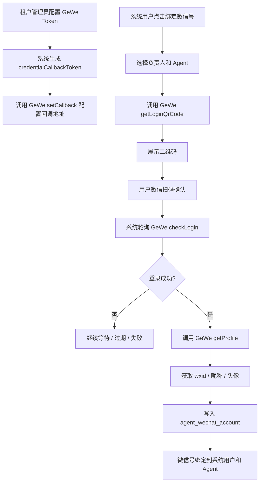
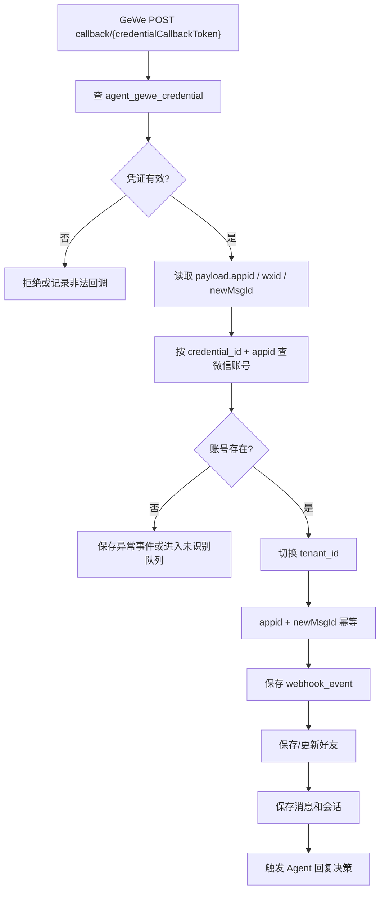
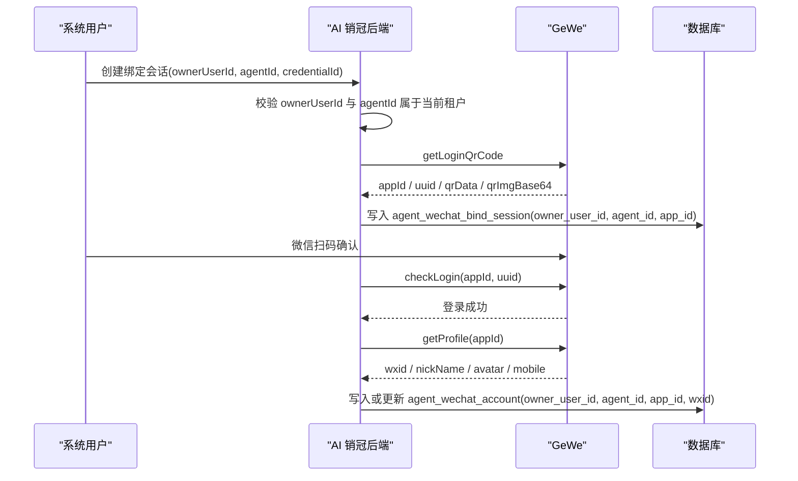

# GeWe 微信号绑定技术方案

日期：2026-05-19
所属项目：ai-sales / AI 销冠
适用范围：GeWe 托管微信账号接入、系统用户与微信号绑定、GeWe 回调路由、微信消息归属处理

## 1. 背景与目标

AI 销冠需要让每个租户下的系统用户绑定一个或多个 GeWe 托管微信号。绑定成功后，微信号收到的好友消息进入 AI 销冠，由该微信号绑定的负责人和 Agent 承接后续回复建议、自动回复、审核与风控。

目标是实现：

- 租户可以配置 GeWe 接入凭证。
- 用户通过扫码登录绑定微信号，不手填微信号或 appId。
- 登录成功后系统自动获取微信身份信息。
- GeWe 回调可以稳定路由到正确租户、微信号、负责人和 Agent。
- 支持 SaaS 多租户隔离。
- 支持一个系统用户管理多个微信号。
- 支持一个租户下多个 GeWe Token，后续可扩容或分组管理。

## 2. GeWe 文档要点

本方案基于 GeWe 官方文档：

- 快速开始：https://doc.geweapi.com/doc-3146201
- Webhook 事件：https://doc.geweapi.com/doc-3146208
- 获取登录二维码：https://doc.geweapi.com/api-139908278
- 执行登录 / checkLogin：https://doc.geweapi.com/api-139908279
- 获取个人资料 / getProfile：https://doc.geweapi.com/api-139908355
- 回调结构 v2.0：https://doc.geweapi.com/doc-8680561

关键结论：

- GeWe 的 Token 是托管能力边界，一个 Token 可以绑定多个微信号。
- 回调地址按 Token 配置，同一个 Token 下所有已登录微信都会推送到同一个回调地址。
- 获取登录二维码阶段返回的是 `appId` 和二维码信息，不是最终微信号。
- 登录状态需要通过 `checkLogin` 轮询确认。
- 登录成功后应通过 `getProfile` 获取当前托管微信的 `wxid`、昵称、头像、手机号等身份信息。
- 回调消息中包含 `appid`、`wxid`、`fromUser`、`toUser`、`newMsgId` 等字段。
- 回调幂等建议使用 `appid + newMsgId`。

## 3. 总体设计结论

采用“租户级 GeWe 凭证 + 用户扫码绑定微信号 + 回调按 callbackToken/appId 路由”的设计。

整体链路：



## 4. 回调地址设计

### 4.1 推荐形式

推荐每个 GeWe 凭证生成一个唯一回调入口：

```text
/admin-api/agent/gewe/callback/{credentialCallbackToken}
```

注意：这仍然是统一回调处理器，只是 URL 中带有凭证级随机令牌。

后端仍可以使用同一个 Controller：

```text
AgentGeweCallbackController.handleCallback(...)
```

### 4.2 不建议使用完全裸地址

不推荐所有 GeWe Token 都配置同一个裸地址：

```text
/admin-api/agent/gewe/callback
```

原因：

- 无法在进入业务处理前识别租户或 GeWe Token。
- 对未落库、刚登录、异常回调、地址校验类请求不友好。
- 安全边界弱，公开地址更容易被伪造请求打入。
- 多租户异常排查困难。
- appId 查不到本地账号时无法判断来源租户和凭证。

推荐处理顺序：

```text
credentialCallbackToken -> agent_gewe_credential -> tenant_id
appid -> agent_wechat_account
appid + newMsgId -> 幂等去重
TenantUtils.execute(tenantId, ...) -> 保存消息和触发处理
```

## 5. 微信号在链路中如何获取

微信号不应由用户手填，应该在扫码登录成功后由 GeWe 返回。

### 5.1 获取二维码

用户发起绑定后，系统调用 GeWe：

```text
POST /gewe/v2/api/login/getLoginQrCode
```

该阶段保存：

- `appId`
- `uuid`
- `qrData`
- `qrImgBase64`
- 过期时间

此时还没有最终微信号，只知道本次登录会话对应的 GeWe `appId`。

### 5.2 轮询登录状态

前端轮询 AI 销冠接口：

```text
GET /admin-api/agent/wechat-account/bind-session/{id}/status
```

AI 销冠后端内部调用 GeWe：

```text
POST /gewe/v2/api/login/checkLogin
```

建议 5 秒一次，直到成功、失败或二维码过期。

### 5.3 登录成功后获取微信身份

登录成功后，系统使用 `appId` 调用：

```text
POST /gewe/v2/api/personal/getProfile
```

从返回结果中获取：

- `wxid`：当前托管微信的唯一标识。
- `nickName`：微信昵称。
- `mobile`：手机号，可选。
- `bigHeadImgUrl` / `smallHeadImgUrl`：头像。

然后写入 `agent_wechat_account`，并绑定：

- `owner_user_id`：系统负责人。
- `agent_id`：消息处理 Agent。
- `gewe_credential_id`：所属 GeWe 凭证。
- `gewe_app_id`：GeWe appId。
- `wechat_id`：微信 `wxid`。

一句话结论：

```text
扫码阶段拿 appId，登录成功后用 appId 调 getProfile 拿 wxid。
```

## 6. 数据模型设计

### 6.1 agent_gewe_credential

租户级 GeWe 接入凭证。

字段建议：

```text
id
tenant_id
name
gewe_api_base_url
gewe_token
callback_token
callback_url
status
is_default
last_callback_time
create_time
update_time
```

说明：

- `gewe_token` 需要加密保存。
- `callback_token` 由系统生成，高强度随机字符串。
- `callback_url` 可由后端根据域名和 `callback_token` 生成，也可以只作为展示字段。
- 一个租户可以有多个 GeWe 凭证。

约束建议：

```text
unique(tenant_id, name)
unique(callback_token)
```

### 6.2 agent_wechat_bind_session

微信扫码绑定会话。

字段建议：

```text
id
tenant_id
credential_id
owner_user_id
agent_id
app_id
uuid
qr_data
qr_img_base64
status
expires_at
bind_account_id
raw_login_payload
raw_profile_payload
create_time
update_time
```

状态建议：

```text
WAIT_SCAN
WAIT_CONFIRM
BOUND
EXPIRED
FAILED
```

说明：

- 绑定会话用于承接二维码生命周期。
- 用户刷新页面后，可以继续查看当前绑定状态。
- 登录成功后，把 `bind_account_id` 指向 `agent_wechat_account.id`。

### 6.3 agent_wechat_account

托管微信账号。

字段建议：

```text
id
tenant_id
gewe_credential_id
agent_id
owner_user_id
gewe_app_id
wechat_id
nickname
avatar
mobile
login_status
bind_status
status
last_online_time
last_heartbeat_time
create_time
update_time
```

当前项目已有 `agent_id`、`owner_user_id`、`gewe_app_id`、`wechat_id`、`nickname`、`avatar` 等字段，可在现有表上演进。

约束建议：

```text
unique(gewe_credential_id, gewe_app_id)
unique(tenant_id, wechat_id)
```

如果业务上要求一个真实微信号不能被任何租户重复绑定，则增加全局约束：

```text
unique(wechat_id)
```

## 7. 后台页面设计

### 7.1 GeWe 接入配置

菜单建议：

```text
AI 销冠 / GeWe 接入配置
```

能力：

- 新增 GeWe Token。
- 配置 GeWe API 地址。
- 设置默认凭证。
- 生成并展示回调地址。
- 一键调用 GeWe `setCallback`。
- 查看最近回调时间。
- 启用 / 停用凭证。

### 7.2 微信账号

当前微信账号页面应从“手工录入账号配置”逐步改为“扫码绑定”。

能力：

- 绑定微信号。
- 展示二维码。
- 选择负责人，默认当前登录用户。
- 选择处理 Agent。
- 查看登录状态。
- 重新扫码。
- 解绑微信号。
- 手动检查在线状态。
- 触发重连。

绑定成功后展示：

```text
微信昵称 / wxid / appId / 负责人 / Agent / 登录状态 / 最近消息时间
```

## 8. 后端 API 设计

### 8.1 GeWe 凭证接口

```text
POST   /admin-api/agent/gewe-credential/create
PUT    /admin-api/agent/gewe-credential/update
GET    /admin-api/agent/gewe-credential/page
GET    /admin-api/agent/gewe-credential/get
DELETE /admin-api/agent/gewe-credential/delete
POST   /admin-api/agent/gewe-credential/{id}/set-callback
```

### 8.2 微信绑定接口

```text
POST /admin-api/agent/wechat-account/bind-session/create
GET  /admin-api/agent/wechat-account/bind-session/{id}
GET  /admin-api/agent/wechat-account/bind-session/{id}/status
POST /admin-api/agent/wechat-account/{id}/check-online
POST /admin-api/agent/wechat-account/{id}/reconnect
POST /admin-api/agent/wechat-account/{id}/unbind
```

创建绑定会话请求：

```json
{
  "credentialId": 1,
  "ownerUserId": 1001,
  "agentId": 2001
}
```

创建绑定会话响应：

```json
{
  "id": 3001,
  "appId": "wx_app_sample_001",
  "qrData": "http://weixin.qq.com/x/sample-login-code",
  "qrImgBase64": "data:image/png;base64,...",
  "status": "WAIT_SCAN",
  "expiresAt": "2026-05-19T16:00:00"
}
```

### 8.3 GeWe 回调接口

```text
POST /admin-api/agent/gewe/callback/{credentialCallbackToken}
```

处理原则：

- 该接口需要忽略登录态和默认租户拦截。
- 先用 `credentialCallbackToken` 找到 `agent_gewe_credential`。
- 再从 payload 中读取 `appid`。
- 用 `gewe_credential_id + appid` 找到 `agent_wechat_account`。
- 使用 `TenantUtils.execute(tenantId, ...)` 进入租户上下文。
- 保存原始回调事件。
- 使用 `appid + newMsgId` 幂等去重。
- 快速返回 GeWe，后续处理尽量异步。

## 9. 回调消息路由

回调处理流程：



路由字段：

```text
credentialCallbackToken -> GeWe 凭证和租户
appid                   -> 托管微信账号
wxid                    -> 当前托管微信身份校验
fromUser / toUser        -> 好友和消息方向判断
newMsgId                 -> 幂等去重
```

## 10. 用户与微信号绑定关系

绑定关系不应只理解为“负责人文本字段”，而应作为业务归属规则：

```text
系统用户 owner_user_id
  -> 拥有多个托管微信号 agent_wechat_account
  -> 每个微信号绑定一个默认 Agent
  -> 微信号下新增好友默认继承该 owner_user_id
```

规则建议：

- 微信号绑定时 `owner_user_id` 必填。
- 负责人必须是当前租户下启用的系统用户。
- 微信号绑定时 `agent_id` 必填或至少有租户默认 Agent。
- 新增好友默认继承微信号负责人。
- 后续好友可以单独改负责人。
- 好友个人策略优先级高于微信号策略。
- 微信号策略优先级高于租户默认策略。

### 10.1 绑定对象定义

这里的“账号和微信号绑定”指的是 AI 销冠系统账号与 GeWe 托管微信号的绑定，不是 GeWe Token 与微信号的绑定。

绑定对象：

```text
系统账号：system_user.id / admin_user.id
微信号：agent_wechat_account.wechat_id，也就是 GeWe getProfile 返回的 wxid
绑定关系承载表：agent_wechat_account
绑定字段：agent_wechat_account.owner_user_id
```

关系基数：

```text
一个租户 tenant
  -> 多个系统账号 user
  -> 每个系统账号可以绑定多个微信号
  -> 每个微信号同一时间只能归属一个系统账号
```

因此，`agent_wechat_account.owner_user_id` 不是展示用备注，而是微信号的当前归属人。客户好友、会话、回复审核、风险接管等后续业务都应能从微信号追溯到这个系统账号。

### 10.2 绑定生成流程

绑定流程从用户发起扫码开始：



绑定成功后，核心落库结果是：

```text
agent_wechat_account.owner_user_id = 被绑定的系统账号
agent_wechat_account.agent_id = 当前微信号默认处理 Agent
agent_wechat_account.gewe_credential_id = 使用的 GeWe 凭证
agent_wechat_account.gewe_app_id = GeWe appId
agent_wechat_account.wechat_id = GeWe getProfile 返回的 wxid
```

### 10.3 绑定规则

规则建议：

- 普通用户发起绑定时，`owner_user_id` 默认为当前登录用户。
- 管理员或具备权限的运营人员可以代其他用户绑定微信号。
- `owner_user_id` 必填，且必须是当前租户下启用的系统用户。
- `agent_id` 必填，且必须是当前租户下启用的 Agent。
- 后端不能信任前端传入的 `tenantId`，租户只能来自登录上下文或 GeWe 凭证路由。
- 绑定成功前，`agent_wechat_account` 不应创建为可用账号；最多保存绑定会话。
- 绑定成功后，禁止再手工修改 `wechat_id / gewe_app_id`，只能通过重新扫码或解绑重绑处理。
- 已绑定微信号更换负责人时，只更新 `owner_user_id`，不改变 `wechat_id` 和 `gewe_app_id`。

### 10.4 重复绑定处理

重复绑定按 `wxid` 判断，而不是按昵称、手机号或用户输入微信号判断。

推荐默认策略：

```text
同租户内 wxid 唯一。
同一个 wxid 再次扫码绑定时，视为重新绑定或更新归属。
```

处理建议：

- 如果 `tenant_id + wechat_id` 已存在，并且状态正常，则提示该微信号已绑定。
- 如果当前操作人有管理权限，可以选择变更负责人或重新绑定 Agent。
- 如果只是同一负责人重新扫码，则更新 `gewe_app_id`、头像、昵称、登录状态。
- 如果 `wechat_id` 已在其他租户存在，默认拒绝或进入人工确认，具体取决于平台是否允许跨租户重复绑定同一个真实微信号。

### 10.5 绑定后的业务归属

绑定成功后，微信号下面产生的数据默认继承微信号归属：

```text
agent_wechat_account.owner_user_id
  -> 新增 agent_wechat_contact.owner_user_id
  -> 新增 agent_conversation
  -> 新增 agent_message
  -> 回复审核与风险会话归属
```

其中客户好友可以后续单独分配负责人。一旦好友有自己的 `owner_user_id`，好友级负责人优先于微信号负责人。

负责人优先级建议：

```text
好友 owner_user_id > 微信号 owner_user_id > 租户默认负责人
```

### 10.6 权限边界

页面与接口的数据权限建议：

- 租户管理员可以查看和管理本租户全部微信号。
- 普通销售默认只查看自己绑定的微信号。
- 普通销售默认只查看自己负责的好友、会话、回复审核和风险会话。
- 具备团队管理权限的用户可以查看团队成员绑定的微信号。
- GeWe 回调处理不使用当前登录用户权限，但必须通过 `credentialCallbackToken` 和 `appid` 找到租户与微信号。

后端需要在查询层逐步补充：

```text
tenant_id = 当前租户
AND (owner_user_id = 当前用户 OR 当前用户具备管理权限)
```

## 11. 安全与隔离

必须保证：

- GeWe Token 加密存储。
- 回调地址使用高强度 `credentialCallbackToken`。
- 回调入口不依赖后台登录用户。
- 回调处理必须显式切换租户上下文。
- 不允许通过前端传入 tenantId 决定数据归属。
- `owner_user_id`、`agent_id` 保存前校验同租户。
- `appid + newMsgId` 做幂等。
- 未识别 appId 的回调不能直接写入普通消息表。
- 日志中不要明文打印 GeWe Token。

## 12. 异常场景

### 12.1 二维码过期

如果超过 GeWe 二维码有效期仍未登录：

- 绑定会话置为 `EXPIRED`。
- 前端提示重新生成二维码。

### 12.2 登录成功但 getProfile 失败

处理建议：

- 绑定会话暂不置为 `BOUND`。
- 记录失败原因。
- 允许用户重试获取资料。
- 多次失败后置为 `FAILED`。

### 12.3 同一微信号重复绑定

按产品策略选择：

- 策略 A：同租户内唯一。重复绑定时更新原账号的负责人和 Agent。
- 策略 B：全平台唯一。其他租户已绑定则拒绝。

推荐默认：先做同租户唯一，后续根据商业规则决定是否全平台唯一。

### 12.4 GeWe 回调先到、账号未落库

可能发生在扫码成功后写库未完成或异常重试时。

处理建议：

- 先按 `credentialCallbackToken` 保存异常原始事件。
- 标记为 `UNMATCHED_ACCOUNT`。
- 不触发 Agent 回复。
- 提供后台排查入口。

### 12.5 微信离线

定时调用 GeWe `checkOnline` 更新状态。

如果离线：

- 标记 `OFFLINE` 或 `EXPIRED`。
- 暂停自动回复。
- 提醒负责人重新扫码或尝试重连。

## 13. 实施顺序建议

### 阶段 1：凭证与绑定闭环

- 新增 `agent_gewe_credential`。
- 新增 `agent_wechat_bind_session`。
- 微信账号页面新增“绑定微信号”入口。
- 实现 `getLoginQrCode`、`checkLogin`、`getProfile`。
- 登录成功后写入 `agent_wechat_account`。

### 阶段 2：回调路由升级

- 回调地址从微信账号级 `callbackToken` 升级为 GeWe 凭证级 `credentialCallbackToken`。
- 回调中按 `credential_id + appid` 查微信账号。
- 保存未识别回调事件。
- 完成 `appid + newMsgId` 幂等。

### 阶段 3：运营与风控完善

- 账号在线状态检查。
- 重连和重新扫码。
- 解绑。
- 负责人/Agent 变更审计。
- 好友继承负责人。
- 数据权限按负责人或角色控制。

## 14. 待确认问题

- 一个真实微信号是否允许跨租户重复绑定。
- GeWe Token 是每个租户自己提供，还是平台统一代管后按租户分配。
- 微信号解绑是否需要调用 GeWe 退出登录接口，还是只在本地停用。
- 修改微信号负责人时，已有好友是否批量同步负责人。
- 未识别回调事件保留时长。
- 回调签名能力是否由 GeWe 提供；如果没有，必须依赖 `credentialCallbackToken` 和来源风控。

## 15. 当前项目落点

当前 AI 销冠已经具备部分基础：

- `agent_wechat_account` 已有 `agent_id` 和 `owner_user_id`。
- 微信账号表单已将 Agent 和负责人改为选择器。
- 回调已有按 token 接收并切换租户处理的基础。

后续应重点补齐：

- GeWe 凭证表。
- 绑定会话表。
- 扫码绑定接口。
- `getProfile` 后自动写入 `wechat_id / nickname / avatar`。
- 回调路由从账号级 token 过渡到凭证级 callback token + appId。
- 微信号负责人必填和同租户校验。
